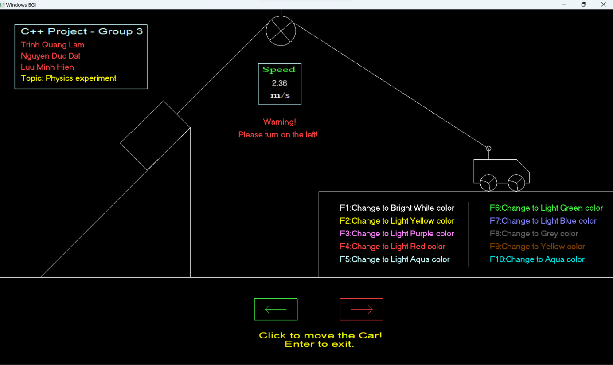

# Thí nghiệm vật lý

Chương trình mô phỏng thí nghiệm vật lý đơn giản: Ô tô kéo vật trượt trên mặt phẳng nghiêng bởi 1 sợi dây mắc qua ròng rọc cố định. Chương trình được xây dựng chủ yếu bằng ngôn ngữ <strong>C++</strong> kết hợp với thư viện <strong>graphics.h</strong>  cùng với các kiến thức liên quan đến hình học phẳng Oxy trong Toán học.  

